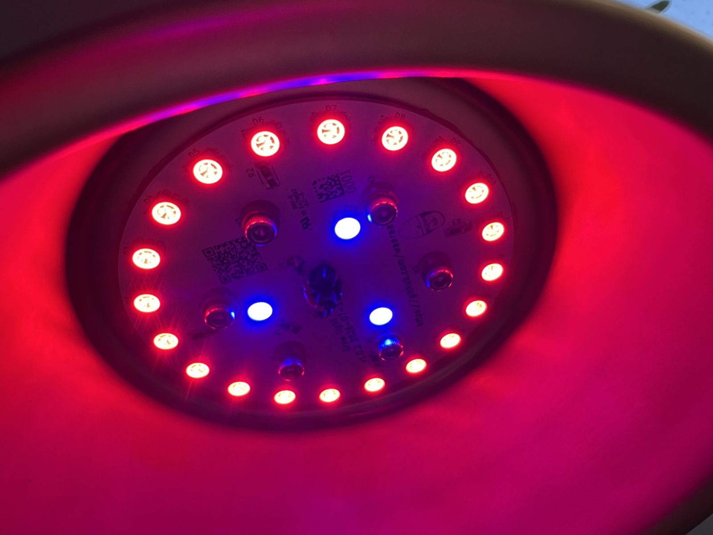
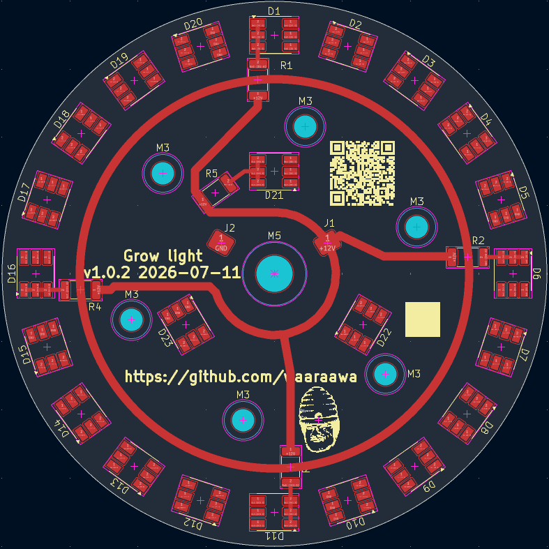
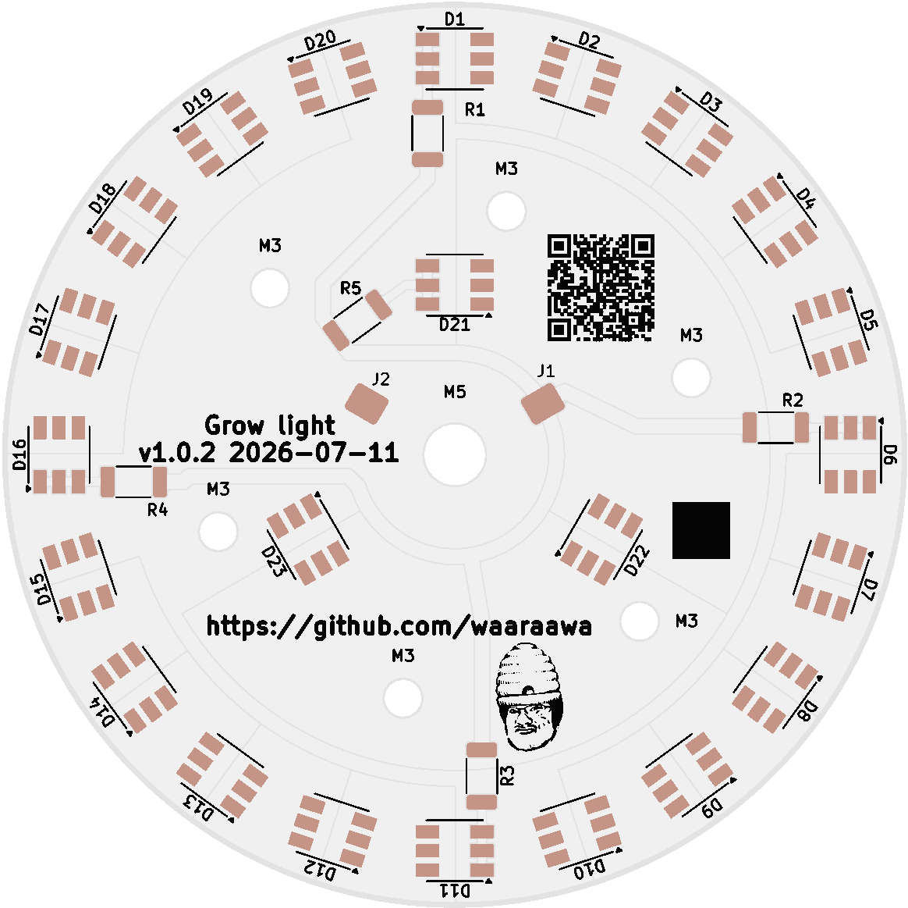
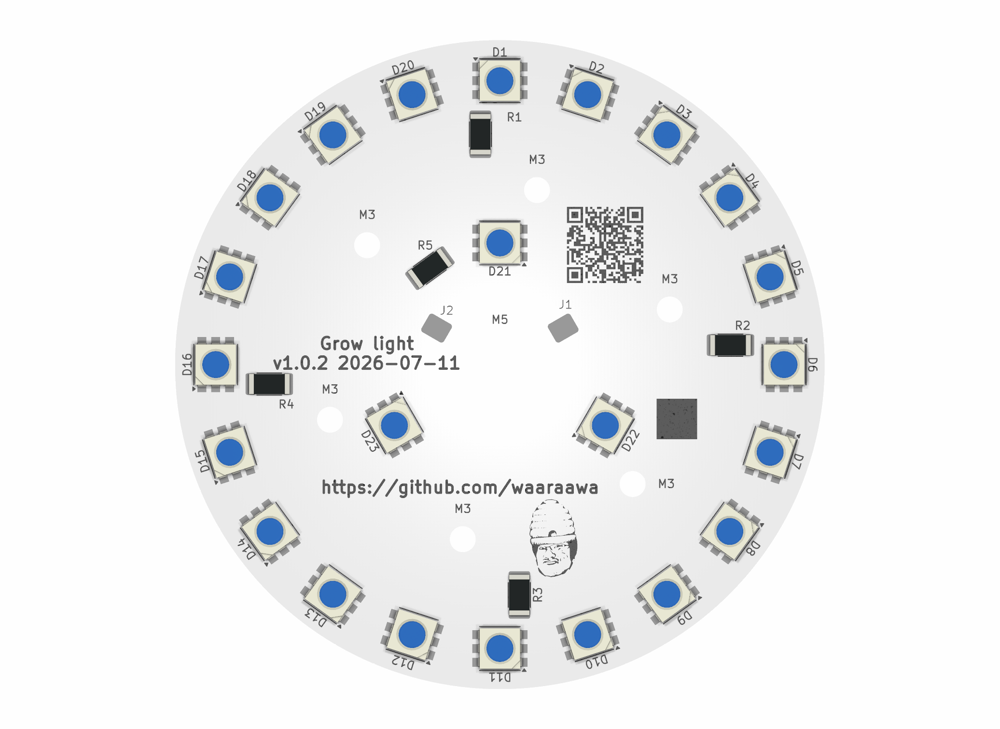
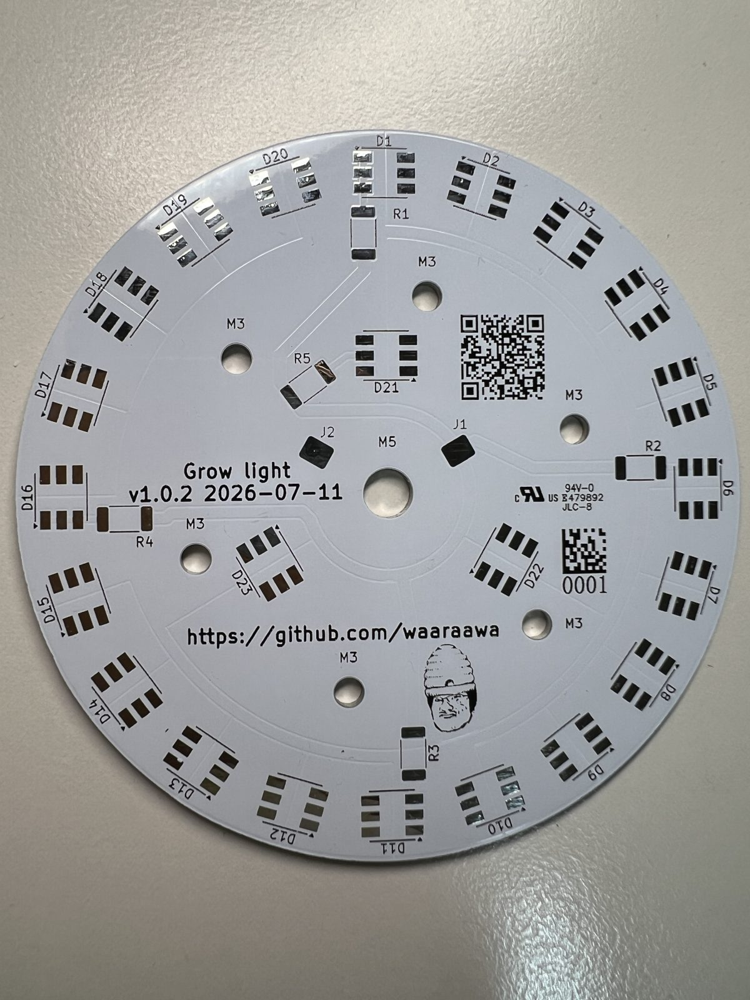
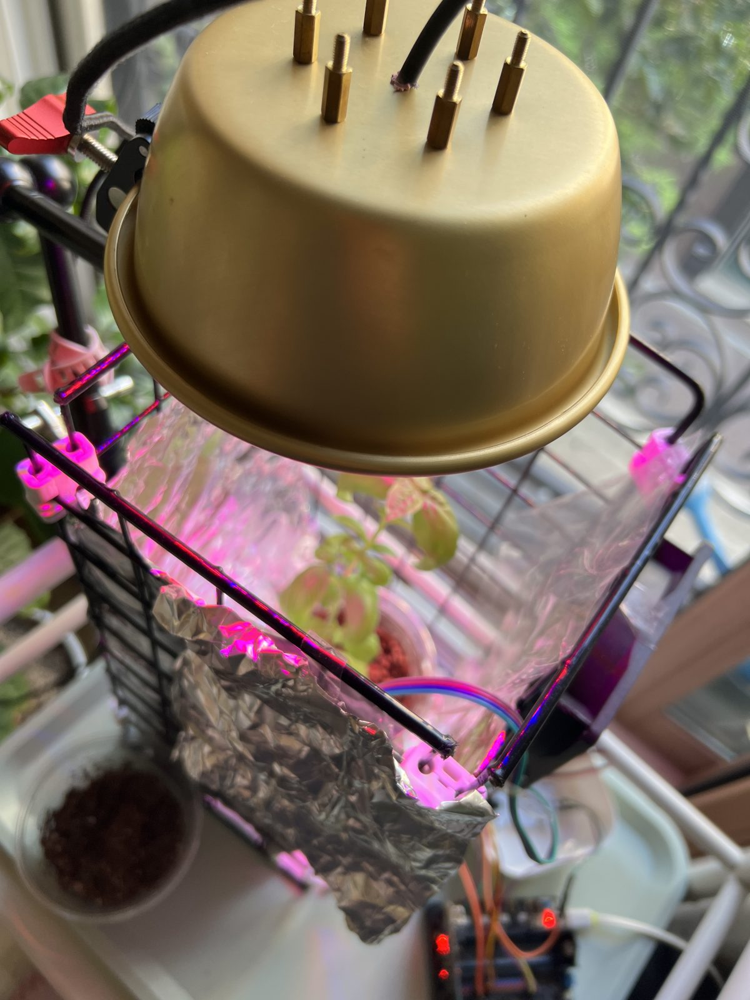

# Grow Light

A circular 12 V LED board designed for growing plants. The board uses a single-sided, 80 mm aluminum MCPCB with 20 red LEDs and 3 blue LEDs. A [medium Daiso aluminum makgeolli cup](https://www.daisomall.co.kr/pd/pdr/SCR_PDR_0001?pdNo=58656) serves as the heatsink and mechanical structure.

## Project Status

- Current KiCad design: `v1.0.3` (`2026-07-27`)
- Manufacturing order version: `v1.0.2` (`2026-07-11`)
- Current phase: `v1.0.2` assembled, functionally tested, and installed
- `v1.0.3` change: added `F.Silkscreen` guides around the six M3 mounting holes and the central cable hole
- Assembly note: the physical `v1.0.2` board currently uses a temporary hand-assembled resistor arrangement pending replacement with correctly sized `5025 Metric (2010 Imperial)` resistors
- DRC: 0 active errors, 0 active warnings, and 0 unconnected pads
- Exclusion: one warning for the unavailable source library of an embedded silkscreen graphic

> The design files in this repository are currently at `v1.0.3`. The previews below and the ordered MCPCB are `v1.0.2`. Manufacturing files for `v1.0.3` have not been generated.

## Specifications

| Item | Specification |
|---|---|
| PCB | 80 mm diameter, 1-layer Aluminum MCPCB |
| PCB thickness | 1.6 mm |
| Copper | 1 oz, `F.Cu` only |
| Surface finish | `HAL SnPb` |
| Solder mask / silkscreen | White / black, front side only |
| Power input | 12 V from a USB-C PD trigger board |
| Target power consumption | Approximately 2 W to 4 W |
| LEDs | 20 red and 3 blue |
| Resistors | Four 68 Ω and one 82 Ω, 2010 package |
| Track widths | 1.2 mm power tracks and 0.6 mm LED interconnects |
| Mounting holes | Six 3.2 mm M3 NPTH holes |
| Cable hole | One central 5.3 mm NPTH hole |

Because KiCad requires an even number of copper layers, the project represents the stackup as a 2-layer board. All electrical copper is on `F.Cu`; `B.Cu` is unused. The actual manufacturing structure is `F.Silkscreen / F.Mask / F.Cu / thermal dielectric / aluminum base`.

## Electrical Configuration

| Channel | LEDs per Series String | Parallel Strings | Total LEDs | String Resistor |
|---|---:|---:|---:|---:|
| Red | 5 | 4 | 20 | 68 Ω |
| Blue | 3 | 1 | 3 | 82 Ω |

The 2010 resistor bodies act as physical jumpers to complete the single-sided routing. Twenty-four `F.Cu` copper zones around the LEDs provide electrical connectivity and local heat spreading. The aluminum core is the primary thermal path, so the design does not use `B.Cu` heat-spreading copper or thermal vias.

## Design Images

### PCB Layout — v1.0.2

### Manufacturing Preview — v1.0.2

### Assembled Board Preview — v1.0.2

### Manufactured PCB

The physical `v1.0.2` aluminum MCPCB after delivery and initial inspection.

### Completed Assembly

The assembled light installed in its intended growing area.

See the [`v1.0.2` build log](docs/build-log-v1.0.2.md) for the complete assembly, hot-plate reflow, aluminum-cup drilling, thermal-interface, testing, and installation process.

## Assembly and Safety

- The red `IWS-L5056-UR-N3` and blue `IWS-L5056-UB-K3` LEDs use opposite footprint polarities. Verify every LED before placement.
- Do not rely on cable colors. Measure the 12 V output and polarity with a multimeter before soldering the cable to `J1 +12V` and `J2 GND`.
- Fit a grommet or strain relief where the cable passes through the central hole.
- Apply electrically non-conductive `UPSIREN UTP-8` in a thin, even layer between the PCB and the aluminum cup.
- Use insulating washers or nylon shoulder washers at the M3 mounting points.
- Before applying power and again after final assembly, verify that the aluminum structure and fasteners are not shorted to `+12V` or `GND`.
- The aluminum structure and external bracket, rather than the PCB, must carry the lamp's mechanical load.

## Repository Contents

- [`plant led.kicad_sch`](plant%20led.kicad_sch): schematic
- [`plant led.kicad_pcb`](plant%20led.kicad_pcb): PCB layout
- [`plant led.kicad_pro`](plant%20led.kicad_pro): KiCad project settings
- [`parts_list.md`](parts_list.md): parts, manufacturing, and assembly specifications
- [`to-do.md`](to-do.md): production, assembly, and test status
- [`docs/build-log-v1.0.2.md`](docs/build-log-v1.0.2.md): physical `v1.0.2` manufacturing, assembly, and installation log
- [`references/datasheets`](references/datasheets): LED datasheets

Manufacturing Gerber files are not included in the repository. The `footprints:` library is also stored in an external directory shared by multiple projects. To open the project in another environment, configure the same shared library path.

## License

This project is licensed under the [MIT License](LICENSE).
